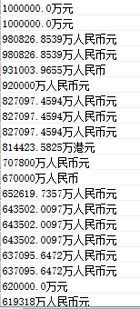

# MySQL 操作语句之案例

## 001 删除数据库中的相同记录

1. distinct
2. group by 字段
3. count(*)>1 根据某个字段统计

````sql
DELETE FROM score WHERE id NOT IN(SELECT * FROM (SELECT id FROM score GROUP BY stu_id,subject)t)
DELETE FROM score WHERE id NOT IN(SELECT * FROM (SELECT id FROM score GROUP BY stu_id,subject)t)
````

### 001001 只保留id最小的重复数据

#### SQL Schema（建表）

```sql
DROP TABLE IF EXISTS Person;
CREATE TABLE Person ( Id INT, Email VARCHAR ( 255 ) );
INSERT INTO Person ( Id, Email ) VALUES
    ( 1, 'a@b.com' ), ( 2, 'c@d.com' ), ( 3, 'a@b.com' ), ( 4, 'a@b.com' );
```

#### Description（问题）

```html
+------+---------+
| Id   | Email   |
+------+---------+
|    1 | a@b.com |
|    2 | c@d.com |
|    3 | a@b.com |
|    4 | a@b.com |
+------+---------+
<!-- 只保留相同 Email 中 Id 最小的那一个，然后删除其它的 -->
+------+---------+
| Id   | Email   |
+------+---------+
|    1 | a@b.com |
|    2 | c@d.com |
+------+---------+
```

#### Solution（解答）

```sql
DELETE FROM `Person` WHERE `ID` NOT IN (SELECT * FROM (SELECT MIN(`ID`) AS id FROM `Person` GROUP BY `Email`) AS a);
-- 这里要注意嵌套一层 SELECT 语句，否则会出现错误：You can't specify target table 'Person' for update in FROM clause
```

### 001002 去除id不同的重复数据

#### SQL Schema

```sql
DROP TABLE IF EXISTS student;
CREATE TABLE student ( id INT, sno VARCHAR ( 20 ), sname VARCHAR ( 20 ), birthday data );
INSERT INTO student ( `id`, `sno`, `sname`, `birthday` ) VALUES
    ( '1', '2018005', 'Amy', '2011-11-11' ), ( '2', '2018006', 'Michael', '2012-12-12' ), ( '3', '2018007', 'Jessie', '2020-02-02' ), ( '4', '2018006', 'Michael', '2012-12-12' );
```

#### Description

```html
+------+---------+---------+------------+
| id   | sno     | sname   | birthday   |
+------+---------+---------+------------+
|    1 | 2018005 | Amy     | 2011-11-11 |
|    2 | 2018006 | Michael | 2012-12-12 |
|    3 | 2018007 | Jessie  | 2020-02-02 |
|    4 | 2018006 | Michael | 2012-12-12 |
+------+---------+---------+------------+
<!-- 删除数据表中，内容重复但 ID 不重复的数据 -->
```

#### Solution

```sql
DELETE FROM student WHERE id NOT IN (SELECT d FROM (SELECT MIN(id) d FROM student GROUP BY sno, sname, birthday) temp);
```

## 002 SQL去重统计

### SQL Schema

```sql
DROP TABLE IF EXISTS courses;
CREATE TABLE courses ( student VARCHAR ( 255 ), class VARCHAR ( 255 ) );
INSERT INTO courses ( student, class ) VALUES
    ( 'A', 'Math' ), ( 'B', 'English' ), ( 'C', 'Math' ), ( 'D', 'Biology' ), ( 'E', 'Math' ),
    ( 'F', 'Computer' ), ( 'G', 'Math' ), ( 'H', 'Math' ), ( 'I', 'Math' );
```

### Description

```html
<!-- 依据字段 class 对数据进行去重统计 -->
+---------+------------+
| student | class      |
+---------+------------+
| A       | Math       |
| B       | English    |
| C       | Math       |
| D       | Biology    |
| E       | Math       |
| F       | Computer   |
| G       | Math       |
| H       | Math       |
| I       | Math       |
+---------+------------+
<!-- 最终结果 -->
+----------+---------------------------+
| class    | COUNT(DISTINCT student)   |
+----------+---------------------------+
| Biology  | 1                         |
| Computer | 1                         |
| English  | 1                         |
| Math     | 6                         |
+----------+---------------------------+
```

### Solution

```sql
SELECT class, COUNT(DISTINCT student) FROM `courses` GROUP BY class
```

## 003 将查询结果集插入到另外一张表

`原则是：需要将结果集的字段类型和插入表的字段一一对应起来，最简单的就是 A、B 表结构一致`

1. 将 A 表查询结果集插入到 B 表

  ````sql
  INSERT INTO B SELECT * FROM A
  ````

2. 由此也可拓展将 A、C 表的联表查询结果集插入到B表中

3. 将查询结果集插入到 B 表指定的字段中

  ````sql
  INSERT INTO B(id,aa,bb,dd) SELECT replace(uuid(), '-', ''),aa,bb,ee FROM A
  ````

## 004 查询结果集拼接"UNION"

````sql
SELECT * FROM user WHERE username LIKE '刘%' AND address LIKE '湖南%' 
UNION 
SELECT * FROM user WHERE username LIKE '黄%' AND address LIKE '广东%'
````

## 005 根据ID查询上一条下一条记录

传入 ID 为'123456'、用户名为'张三'，前端数据根据用户名排序，且过滤条件为年龄> 20）

上一条记录：

````sql
SELECT * FROM user WHERE age>20 AND username<'张三' 
UNION 
SELECT * FROM user WHERE age>20 AND username='张三' AND id<'123456'
ORDER BY username DESC, id DESC LIMIT 0, 1
````

下一条记录：

````sql
SELECT * FROM user WHERE age>20 AND username>'张三' 
UNION 
SELECT * FROM user WHERE age>20 AND username='张三' AND id>'123456'
ORDER BY username, id LIMIT 0, 1
````

`PS:在MyBatis中注意对大于小于进行转换：">" → "&gt;"；"<" → "&lt;"`

## 006 删除数据库中的所有表

````sql
-- 其中 mydb 为具体数据库名称
SELECT CONCAT('DROP TABLE IF EXISTS ', table_name,';') FROM information_schema.`TABLES` WHERE TABLE_SCHEMA='mydb';
````

然后复制查询得到的结果集语句，全部执行：

````sql
DROP TABLE IF EXISTS xx;
DROP TABLE IF EXISTS xxx;
DROP TABLE IF EXISTS xxxx;
......
````

## 007 字符串数字排序或比较

这里遇到的情况是需要根据企业注册资金排序，但是存储的字段为文本类型，导致排序错乱不准确。

这时候需要把字符串转成数字再排序。

最简单的办法就是在排序的字段后面加上+0：（尽管数据中包含中文单位，而且貌似能过滤掉"NULL"等中文字符）

```sql
SELECT 注册资金 FROM table_name ORDER BY 注册资金+0 desc limit 0,1000
```



## 008 员工职位自关联

### 008001 查询上下级关系

#### SQL Schema

```sql
DROP TABLE IF EXISTS Employee;
CREATE TABLE Employee (Id INT, NAME VARCHAR (255), Salary INT, ManagerId INT);
INSERT INTO Employee (Id, NAME, Salary, ManagerId) VALUES
    ( 1, 'Joe', 70000, 3 ), ( 2, 'Henry', 80000, 4 ), ( 3, 'Sam', 60000, NULL ), ( 4, 'Max', 90000, NULL );
```

#### Description

```html
<!-- 职工表 -->
+------+-------+--------+-----------+
| Id   | NAME  | Salary | ManagerId |
+------+-------+--------+-----------+
|    1 | Joe   |  70000 |         3 |
|    2 | Henry |  80000 |         4 |
|    3 | Sam   |  60000 |      NULL |
|    4 | Max   |  90000 |      NULL |
+------+-------+--------+-----------+
<!-- 根据上表的上下级信息，查询出下图的结果 -->
+------------+---------+
| LeaderName | EmpName |
+------------+---------+
| Joe        | NULL    |
| Henry      | NULL    |
| Sam        | Joe     |
| Max        | Henry   |
+------------+---------+
```

####  Solution

```sql
SELECT e.`NAME` LeaderName, m.`NAME` EmpName FROM Employee e LEFT JOIN Employee m ON e.id = m.`ManagerId`;
```

### 008002 查找薪资大于其上级的员工

#### SQL Schema

```sql
DROP TABLE IF EXISTS Employee;
CREATE TABLE Employee (Id INT, NAME VARCHAR (255), Salary INT, ManagerId INT);
INSERT INTO Employee (Id, NAME, Salary, ManagerId) VALUES
    ( 1, 'Joe', 70000, 3 ), ( 2, 'Henry', 80000, 4 ), ( 3, 'Sam', 60000, NULL ), ( 4, 'Max', 90000, NULL );
```

#### Description

```html
+------+-------+--------+-----------+
| Id   | NAME  | Salary | ManagerId |
+------+-------+--------+-----------+
|    1 | Joe   |  70000 |         3 |
|    2 | Henry |  80000 |         4 |
|    3 | Sam   |  60000 |      NULL |
|    4 | Max   |  90000 |      NULL |
+------+-------+--------+-----------+
<!-- 查找薪资大于其经理薪资的员工信息 -->
```

#### Solution

```sql
SELECT a.* FROM Employee a, Employee b WHERE a.`ManagerId`=b.`Id` AND a.`Salary`>b.`Salary`;
```

### 008003 查找部门中薪资最高的员工

#### SQL Schema

```sql
DROP TABLE IF EXISTS Employee;
CREATE TABLE Employee ( Id INT, NAME VARCHAR ( 255 ), Salary INT, DepartmentId INT );
DROP TABLE IF EXISTS Department;
CREATE TABLE Department ( Id INT, NAME VARCHAR ( 255 ) );
INSERT INTO Employee ( Id, NAME, Salary, DepartmentId )
VALUES
    ( 1, 'Joe', 70000, 1 ),
    ( 2, 'Henry', 80000, 2 ),
    ( 3, 'Sam', 60000, 2 ),
    ( 4, 'Max', 90000, 1 );
INSERT INTO Department ( Id, NAME )
VALUES
    ( 1, 'IT' ),
    ( 2, 'Sales' );
```

#### Description

```html
<!-- Employee 表 -->
+----+-------+--------+--------------+
| Id | Name  | Salary | DepartmentId |
+----+-------+--------+--------------+
| 1  | Joe   | 70000  | 1            |
| 2  | Henry | 80000  | 2            |
| 3  | Sam   | 60000  | 2            |
| 4  | Max   | 90000  | 1            |
+----+-------+--------+--------------+
 <!-- Department 表 -->
+----+----------+
| Id | Name     |
+----+----------+
| 1  | IT       |
| 2  | Sales    |
+----+----------+
<!-- 查找一个 Department 中收入最高者的信息 -->
+------------+----------+--------+
| Department | Employee | Salary |
+------------+----------+--------+
| IT         | Max      | 90000  |
| Sales      | Henry    | 80000  |
+------------+----------+--------+
```

#### Solution

````sql
-- 思路：先查 Department 表，根据 MAX() 函数得到只有最高工资的临时表，然后 Department 表和 Department 表，三表关联查询，得到结果
SELECT a.`Id`, a.`NAME`, a.`Salary`, b.`NAME` AS departName FROM Employee a, Department b,
  (SELECT MAX(`Salary`) AS Salary FROM `Employee` GROUP BY `DepartmentId`) c 
WHERE a.`DepartmentId` = b.`Id` AND a.`Salary` = c.`Salary`;
````

### 008004 查找第N高薪资

#### SQL Schema

```sql
DROP TABLE
IF
    EXISTS Employee;
CREATE TABLE Employee ( Id INT, Salary INT );
INSERT INTO Employee ( Id, Salary )
VALUES
    ( 1, 100 ),
    ( 2, 200 ),
    ( 3, 300 );
```

#### Description

```html
+------+--------+
| Id   | Salary |
+------+--------+
|    1 |    200 |
|    2 |    200 |
|    3 |    200 |
+------+--------+
<!-- 查找第 N 高的工资 -->
```

#### Solution

```sql
SELECT (SELECT DISTINCT Salary FROM Employee ORDER BY Salary DESC LIMIT 1,1) Salary;
-- 这里以查找第二高的工资为例，通过排序和分页实现；最外部嵌套一层 SELECT 是为了在没有查找到数据时返回 null
```

## 009 学生成绩查询

### SQL Schema

```sql
DROP TABLE IF EXISTS student;
CREATE TABLE student (id INT, sname VARCHAR (20));
DROP TABLE IF EXISTS grade;
CREATE TABLE grade (id INT, sid INT, course VARCHAR (20), score VARCHAR (20));
INSERT INTO student (id, sname) VALUES ( 1, 'Amy' ), ( 2, 'Michael' ), ( 3, 'Jessie' );
INSERT INTO grade (id, sid, course, score) VALUES ( 1, 1, 'Chinese', '40' ), ( 2, 1, 'Math', '100' ), ( 3, 2, 'Chinese', '80' ), ( 4, 2, 'English', '90' ), ( 5, 2, 'Math', '80' ), ( 6, 3, 'Chinese', '90' ), ( 7, 3, 'English', '60' ), ( 8, 3, 'Math', '90' );
```

### Description

```html
<!-- 学生表 -->
+------+---------+
| id   | sname   |
+------+---------+
|    1 | Amy     |
|    2 | Michael |
|    3 | Jessie  |
+------+---------+
<!-- 成绩表 -->
+------+------+---------+-------+
| id   | sid  | course  | score |
+------+------+---------+-------+
|    1 |    1 | Chinese | 40    |
|    2 |    1 | Math    | 100   |
|    3 |    2 | Chinese | 80    |
|    4 |    2 | English | 90    |
|    5 |    2 | Math    | 80    |
|    6 |    3 | Chinese | 90    |
|    7 |    3 | English | 60    |
|    8 |    3 | Math    | 90    |
+------+------+---------+-------+
<!-- 用一条 SQL 查询出每门课成绩都大于 80 分的学生姓名 -->
```

### Solution

```sql
SELECT s.`sname` FROM student s, grade g WHERE s.id = g.sid GROUP BY s.sname HAVING MIN(g.`score` + 0) >= 80;
-- 这里因为成绩是字符串类型，所以需要转换为 INT，才能适用 MIN() 函数
```

### Description

```html
<!-- 统计每个学生的分数及总分，得到以下视图 -->
+---------+---------+------+---------+------------+
| sname   | Chinese | Math | English | TotalScore |
+---------+---------+------+---------+------------+
| Amy     | 40      | 100  | 0       |        140 |
| Jessie  | 90      | 90   | 60      |        240 |
| Michael | 80      | 80   | 90      |        250 |
+---------+---------+------+---------+------------+
```

### Solution

```sql
SELECT t.sname, 
	MAX(CASE course WHEN 'Chinese' THEN score ELSE 0 END ) Chinese,
	MAX(CASE course WHEN 'Math' THEN score ELSE 0 END ) Math,
	MAX(CASE course WHEN 'English' THEN score ELSE 0 END ) English,
	SUM(score) TotalScore
FROM (SELECT sname, course, score FROM student a, grade b WHERE a.id=b.sid) t GROUP BY t.sname;
```

## 010 管理查询得虚拟表

用一个 SQL 语句从 table1，table2 中取出如 table3 所列格式的数据


```sql
SELECT tb.dep 部门dep,
    (SELECT yj FROM table1 ta WHERE ta.dep=tb.dep AND ta.mon='一月份') 一月份,
    (SELECT yj FROM table1 ta WHERE ta.dep=tb.dep AND ta.mon='二月份') 二月份,
    (SELECT yj FROM table1 ta WHERE ta.dep=tb.dep AND ta.mon='三月份') 三月份 
FROM table2 tb;
```

## 011 导出数据表字段信息

```sql
SELECT TABLE_NAME '表名',
    COLUMN_NAME '字段名',
    COLUMN_TYPE '数据类型',
    COLUMN_COMMENT '备注'
FROM information_schema.COLUMNS WHERE TABLE_SCHEMA = '库名' and table_name = '表名';
```

## 012 SQL语法的异或运算"^"

> 异或运算结合案例进行理解

```html
| id | name | sex | salary |
|----|------|-----|--------|
| 1  | A    | m   | 2500   |
| 2  | B    | f   | 1500   |
| 3  | C    | m   | 5500   |
| 4  | D    | f   | 500    |
```

只用一个 SQL 查询，将 sex 字段反转。

```html
| id | name | sex | salary |
|----|------|-----|--------|
| 1  | A    | f   | 2500   |
| 2  | B    | m   | 1500   |
| 3  | C    | f   | 5500   |
| 4  | D    | m   | 500    |
```

两个相等的数`异或`的结果为 0，而 0 与任何一个数`异或`的结果为这个数。

针对字符串，CHAR() 可以把 ASCII 码转换为字符

sex 字段只有两个取值：'f' 和 'm'，并且有以下规律：

```sql
'f' ^ ('m' ^ 'f') = 'f' ^ 'm' ^ 'f' = 'm' ^ ('f' ^ 'f') = 'm'
'm' ^ ('m' ^ 'f') = 'm' ^ 'm' ^ 'f' = 'f' ^ ('m' ^ 'm') = 'f'
```

因此将 sex 字段和 'm' ^ 'f' 进行异或操作，最后就能反转 sex 字段。

```sql
UPDATE salary SET sex = CHAR ( ASCII(sex) ^ ASCII( 'm' ) ^ ASCII( 'f' ) );
```

## 013 得分排名

### SQL Schema

```sql
DROP TABLE IF EXISTS Scores;
CREATE TABLE Scores ( Id INT, Score DECIMAL ( 3, 2 ) );
INSERT INTO Scores ( Id, Score ) VALUES ( 1, 4.1 ), ( 2, 4.1 ), ( 3, 4.2 ), ( 4, 4.2 ), ( 5, 4.3 ), ( 6, 4.3 );
```

### Description

```html
<!-- 得分表 -->
+----+-------+
| Id | Score |
+----+-------+
| 1  | 3.50  |
| 2  | 3.65  |
| 3  | 4.00  |
| 4  | 3.85  |
| 5  | 4.00  |
| 6  | 3.65  |
+----+-------+
<!-- 将得分排序，并统计排名 -->
+-------+------+
| Score | Rank |
+-------+------+
| 4.00  | 1    |
| 4.00  | 1    |
| 3.85  | 2    |
| 3.65  | 3    |
| 3.65  | 3    |
| 3.50  | 4    |
+-------+------+
```

### Solution

```sql
-- 思路：要统计某个 score 的排名，只要统计大于等于该 score 的记录数量
-- 根据条件 S1.score <= S2.score 内连接（INNER JOIN）
SELECT
	*
FROM
    Scores S1
    INNER JOIN Scores S2
    ON S1.score <= S2.score
ORDER BY
    S1.score DESC, S1.Id;
-- 因为内连接会关联 N 条 score 相同的记录，所以要对分数 score 进行分组操作，同时使用 COUNT() 函数，统计记录的数量
SELECT
    S1.score 'Score',
    COUNT(*) 'Rank'
FROM
    Scores S1
    INNER JOIN Scores S2
    ON S1.score <= S2.score
GROUP BY
    S1.id, S1.score
ORDER BY
    S1.score DESC, S1.Id;
-- 因为分数相同的记录，排名并列，所以要对分数 score 进行去重操作，最终得出正确的排序
SELECT
    S1.score 'Score',
    COUNT( DISTINCT S2.score ) 'Rank'
FROM
    Scores S1
    INNER JOIN Scores S2
    ON S1.score <= S2.score
GROUP BY
    S1.id, S1.score
ORDER BY
    S1.score DESC, S1.Id;
```

## 014 找出连续出现3次的数字

### SQL Schema

```sql
DROP TABLE IF EXISTS LOGS;
CREATE TABLE LOGS ( Id INT, Num INT );
INSERT INTO LOGS ( Id, Num ) VALUES ( 1, 1 ), ( 2, 1 ), ( 3, 1 ), ( 4, 2 ), ( 5, 1 ), ( 6, 2 ), ( 7, 2 );
```

### Description

```html
<!-- 数字表 -->
+----+-----+
| Id | Num |
+----+-----+
| 1  |  1  |
| 2  |  1  |
| 3  |  1  |
| 4  |  2  |
| 5  |  1  |
| 6  |  2  |
| 7  |  2  |
+----+-----+
<!-- 查找连续出现三次的数字 -->
+-----------------+
| ConsecutiveNums |
+-----------------+
| 1               |
+-----------------+
```

### Solution

```sql
-- 自关联三次，根据 id 的 -1 进行匹配，num 是否相等进行判断
SELECT
    DISTINCT L1.num ConsecutiveNums
FROM
    LOGS L1,
    LOGS L2,
    LOGS L3
WHERE L1.id = l2.id - 1
    AND L2.id = L3.id - 1
    AND L1.num = L2.num
    AND l2.num = l3.num;
```

## 015 Exchange Seats

### SQL Schema

```sql
DROP TABLE IF EXISTS seat;
CREATE TABLE seat ( id INT, student VARCHAR ( 255 ) );
INSERT INTO seat ( id, student ) VALUES ( '1', 'Abbot' ), ( '2', 'Doris' ), ( '3', 'Emerson' ), ( '4', 'Green' ), ( '5', 'Jeames' );
```

### Description

```html
<!-- seat 表存储着座位对应的学生 -->
+---------+---------+
|    id   | student |
+---------+---------+
|    1    | Abbot   |
|    2    | Doris   |
|    3    | Emerson |
|    4    | Green   |
|    5    | Jeames  |
+---------+---------+
<!-- 交换相邻座位的两个学生，如果最后一个座位是奇数，那么不交换这个座位上的学生 -->
+---------+---------+
|    id   | student |
+---------+---------+
|    1    | Doris   |
|    2    | Abbot   |
|    3    | Green   |
|    4    | Emerson |
|    5    | Jeames  |
+---------+---------+
```

### Solution

```sql
-- 使用 UNION 拼接结果
# 处理偶数 id，让 id 减 1
# 例如 2,4,6,... 变成 1,3,5,...
SELECT
    s1.id - 1 AS id,
    s1.student
FROM
    seat s1
WHERE
    s1.id MOD 2 = 0 UNION
# 处理奇数 id，让 id 加 1。但是如果最大的 id 为奇数，则不做处理
# 例如 1,3,5,... 变成 2,4,6,...
SELECT
    s2.id + 1 AS id,
    s2.student
FROM
    seat s2
WHERE
    s2.id MOD 2 = 1
    AND s2.id != ( SELECT max( s3.id ) FROM seat s3 ) UNION
# 如果最大的 id 为奇数，单独取出这个数
SELECT
    s4.id AS id,
    s4.student
FROM
    seat s4
WHERE
    s4.id MOD 2 = 1
    AND s4.id = ( SELECT max( s5.id ) FROM seat s5 )
ORDER BY
    id;
```

## 016 胜负统计

### SQL Schema

```sql
DROP TABLE IF EXISTS tmp;
CREATE TABLE tmp(rq VARCHAR(10), shengfu NCHAR(1));
INSERT INTO tmp VALUES('2005-05-09', 'W'), ('2005-05-09', 'W'), ('2005-05-09', 'L'), ('2005-05-09', 'L'), ('2005-05-10', 'W'), ('2005-05-10', 'W'), ('2005-05-10', 'D');
```

### Description

```html
<!-- 胜负情况表（W：胜；L：败；D：平） -->
+------------+---------+
| rq         | shengfu |
+------------+---------+
| 2005-05-09 | W       |
| 2005-05-09 | W       |
| 2005-05-09 | L       |
| 2005-05-09 | L       |
| 2005-05-10 | W       |
| 2005-05-10 | W       |
| 2005-05-10 | D       |
+------------+---------+
<!-- 统计胜负信息，得到下图 -->
+------------+------+------+------+
| rq         | W    | L    | D    |
+------------+------+------+------+
| 2005-05-09 |    2 |    2 |    0 |
| 2005-05-10 |    2 |    0 |    1 |
+------------+------+------+------+
```

### Solution

```sql
SELECT rq, SUM(shengfu='W') 'W', SUM(shengfu='L') 'L', SUM(SHENGFU='D') 'D' FROM tmp GROUP BY rq;

SELECT rq, 
	SUM(CASE WHEN shengfu='W' THEN 1 ELSE 0 END) 'W', 
	SUM(CASE WHEN shengfu='L' THEN 1 ELSE 0 END) 'L', 
	SUM(CASE WHEN shengfu='D' THEN 1 ELSE 0 END) 'D' 
FROM tmp GROUP BY rq;
```

