# MySQL 配置

## 一、配置数据库环境变量

Path 变量添加 bin 路径：E:\Program Files\MySQL\MySQL Server 5.5\bin

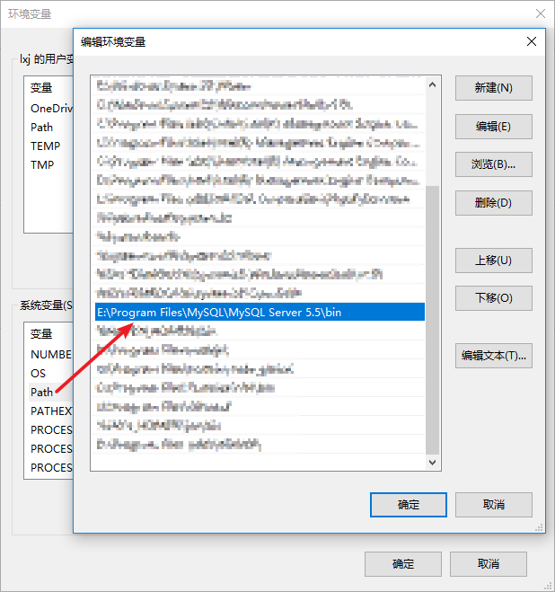

## 二、数据库默认端口以及字符编码修改

首先拷贝数据库安装目录下的 my-default.ini 文件，命名为 my.ini

编辑 my.ini 文件：

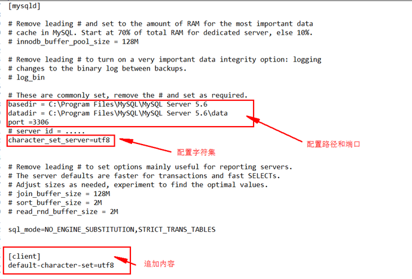

## 三、修改 MySQL 数据存储路径

### 3.1. 关闭 MySQL 数据库

进入 cmd 控制台，执行：net stop mysql
这里可能会报`发生系统错误 5`的错误：

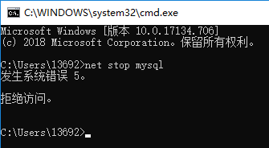

这是因为 cmd 的权限不够所导致的，可以到`C:\Windows\System32`下找到`cmd.exe`，右击，`以管理员身份运行`

### 3.2. 复制原来数据库目录到新位置

复制`C:\ProgramData\MySQL\MySQL Server 5.5\`中的`data目录`到新位置`E:\Program Files\MySQL\MySQL Server 5.5\data`

### 3.3. 修改 MySQL 配置文件

* 记事本打开 MySQL 安装目录`E:\Program Files\MySQL\MySQL Server 5.5`下的`my.ini`文件
* 找到`datadir="C:\ProgramData\MySQL\MySQL Server 5.5\data"`并注释
* 修改为新位置：`datadir="E:\Program Files\MySQL\MySQL Server 5.5\data"`
* 保存退出

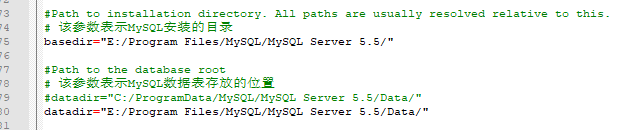

### 3.4. 重新启动 MySQL

进入 cmd 控制台，执行：net start mysql

### 3.5. 查看 MySQL 数据存储路径

登录 MySQL 数据库，执行命令：`show variables like '%datadir%'; #查询MySQL数据库存放目录`

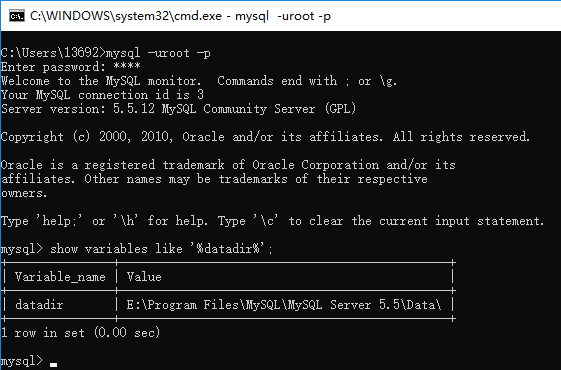

## 四、安装 MySQL 服务

使用管理员身份打开CMD或者任意DOS环境,然后执行安装命令：`–mysqld -install`


## 五、MySQL 服务的开启和关闭

````bash
net start mysql # 开启
net stop mysql # 关闭
````

## 六、通过 root 创建用户并授权

### 6.1 查看所有用户

````sql
select user,host from mysql.user;
````

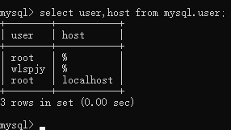

### 6.2 创建用户

````sql
-- 指定ip：192.168.200.131的liangxj用户登录
create user 'liangxj'@'192.168.200.131' identified by '123456';
-- 指定ip：192.168.200.开头的liangxj用户登录
create user 'liangxj'@'192.168.200.%' identified by '123456';
-- 指定任何ip的liangxj用户登录
create use 'liangxj'@'%' identified by '123456';
````

刚创建用户能登录，但是没有什么权限，不能查阅的数据库

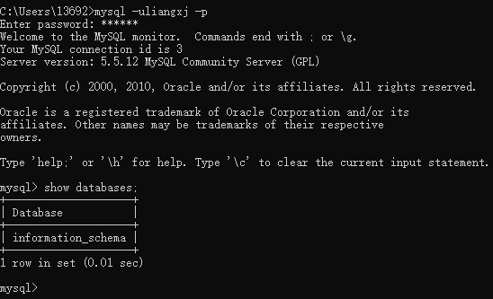

### 6.3 查看用户权限

````sql
show grants for '用户'@'IP地址';
show grants for 'liangxj'@'%';
````

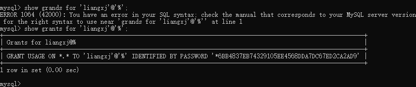

### 6.4 授权

````sql
-- %号代表这个用户允许从任何地方登录
grant select,insert,update on databasename.tablename to "liangxj"@'%';
grant all privileges on databasename.tablename to "liangxj"@'%';
-- *号表示所有，故*.* 代表所有库下面的所有表
-- "all privileges"只能root用户使用
grant all privileges on databasename.* to "liangxj"@'%';
grant all privileges on *.* to "liangxj"@'%';
````

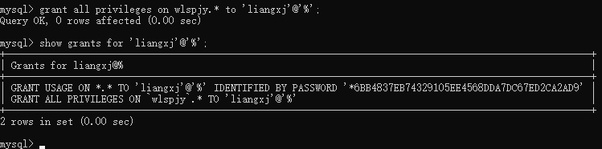

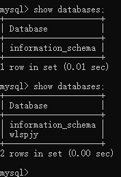

### 6.5 取消用户权限

````sql
-- 取消来自远程服务器的liangxj用户对数据库databasename的所有表的所有权限
revoke all on databasename.* from 'liangxj'@"%";
-- 取消来自远程服务器的liangxj用户所有数据库的所有的表的权限
revoke all privileges on '*' from 'liangxj'@'%';
````

### 6.6 删除用户

````sql
drop user '用户名'@'IP地址';
drop user 'liangxj'@'%';
````

## 七、修改 ROOT 用户密码（修改密码）

这个的前提是登录了数据库，拥有对用户修改密码的权限

````bash
use mysql
update user set password=password("123456") where user="root"
flush privileges
````

## 八、重置 ROOT 用户密码（忘记密码）

````bash
net stop mysql # 停止MySQL服务
mysqld --skip-grant-tables # 使用命令启动无权限MySQL进程
mysql # 打开一个新的cmd窗口，进入mysql
# 修改root密码
# 杀掉使用命令启动无权限MySQL进程
````

## 九、查看 MySQL 数据库服务器和数据库 MySQL 字符集

````bash
show variables like '%char%'; 
show variables like 'collation_%';
````

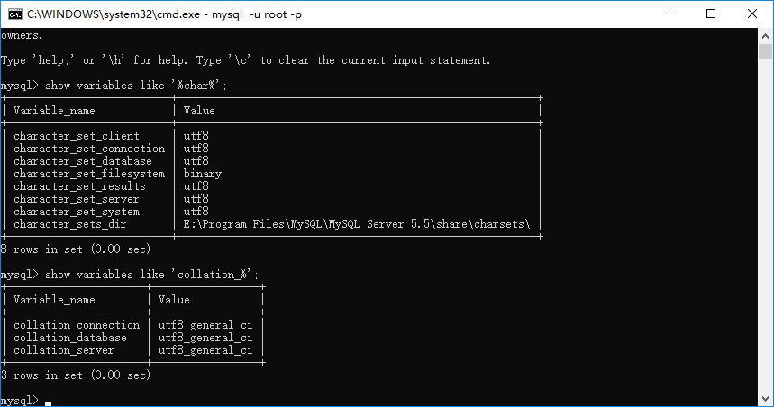