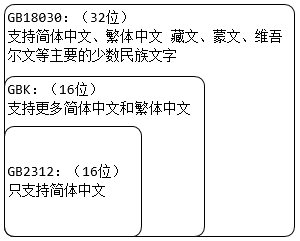

# 文字编码说明

### 仅中文编码

GB2312(1980年) ﹤ GBK(1995年) ﹤ GB18030(2000年)

> 1个字节(Byte) = 8个比特位(bit)
> 1个比特位就是0或1

### UTF-8 和 GBK 区别

1. GBK 主要用于中文编码，包含全部中文字符；UTF-8 包含全世界所有国家需要用到的字符
2. GBK 的长度为2个字节（16个比特位）；UTF-8 比较灵活，长度在1-6个字节；因此 UTF-8 会占用更多的数据库存储空间

