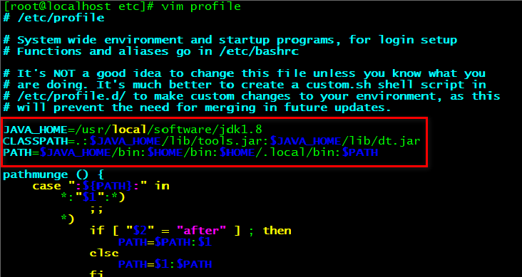

# JDK 环境配置

## 一、解压安装JDK

1、在Linux系统的/usr/local路径下新建一个文件夹software（个人习惯）；
2、把Linux类型的jdk安装包（jdk-8u144-linux-x64.tar.gz）通过SecureFX拉到文件夹下解压
	tar zxvf jdk-8u144-linux-x64.tar.gz
（PS:可以修改解压后的文件夹名：mv A B —— 将目录A重命名为B）

## 二、配置环境变量

1、环境变量位置：vim /etc/profile，添加Java环境配置：

````bash
JAVA_HOME=/usr/local/jdk1.7.0_71
CLASSPATH=.:$JAVA_HOME/lib/dt.jar:$JAVA_HOME/lib/tools.jar
PATH=$JAVA_HOME/bin:$HOME/bin:$HOME/.local/bin:$PATH
````



（PS:注意是实际的jdk文件夹路径，i进入编辑模式，esc，:+wq保存退出，:+q只是退出不保存）
（如果vim命令不起效，则把提示复制到百度。。。）

2、使用命令：`source /etc/profile`，刷新配置