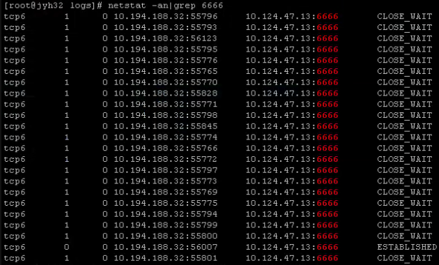
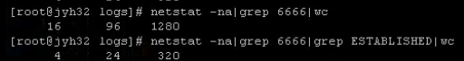

# Linux-netstat 命令

> Linux netstat 命令用于显示与 IP、TCP、UDP 和 ICMP 协议相关的统计数据，一般用于检验本机各端口的网络连接情况。
> netstat 是在内核中访问网络及相关信息的程序，它能提供 TCP 连接，TCP 和 UDP 监听，进程内存管理的相关报告。

````bash
netstat -na|grep 端口号 #显示所有连接的端口并用数字表示
netstat -na|grep 6666
````



其中，CLOSE_WAIT 表示已经关闭，处于侦听状态的网络连接（一有需要会立即连接）；ESTALISHED  表示已经建立的网络连接。

````bash
netstat -na|grep 端口号|wc #统计连接端口的数量
netstat -na|grep 端口号|grep ESTALISHED|wc #统计已经建立网络连接的数量
````



<kbd>-a</kbd>：显示所有连接和监听端口

<kbd>-b</kbd>：显示包含于创建每个连接或监听端口的可执行组件

<kbd>-e</kbd>：显示以太网统计信息。此选项可以与 -s 选项组合使用

<kbd>-n</kbd>：以数字形式显示地址和端口号

<kbd>-o</kbd>：显示与每个连接相关的所属进程 ID

<kbd>-p</kbd>：选项用于指定默认情况的子集

<kbd>-p proto</kbd>：显示 proto 指定的协议的连接。proto 可以为：TCP、UDP、TCPv6 或 UDPv6。若与 -s 一起使用以显示按协议统计信息，proto 可以为：IP、IPv6、ICMP、ICMPv6、TCP、TCPv6、UDP 或 UDPv6

<kbd>-r</kbd>：显示路由表

<kbd>-s</kbd>：显示按协议统计信息。默认显示：IP、IPv6、ICMP、ICMPv6、TCP、TCPv6、UDP 和 UDPv6 的统计信息

<kbd>-t</kbd>：显示当前连接卸载状态

<kbd>-v</kbd> 与 <kbd>-b</kbd> 选项一起使用时将显示包含于为所有可执行组件创建连接或监听端口的组件