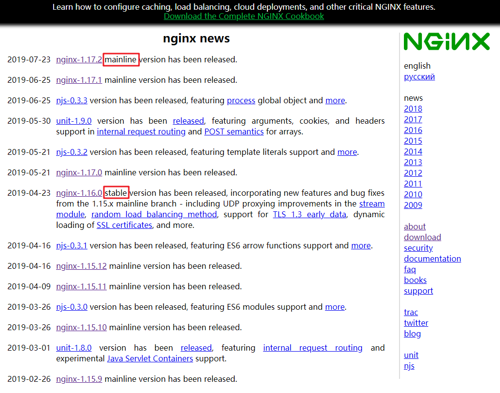
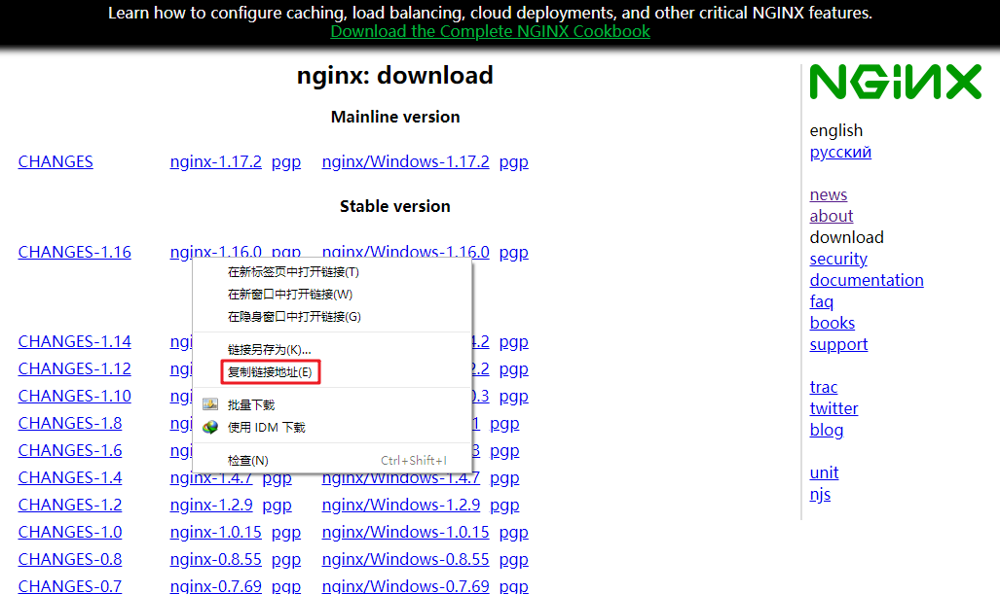
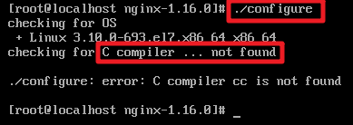
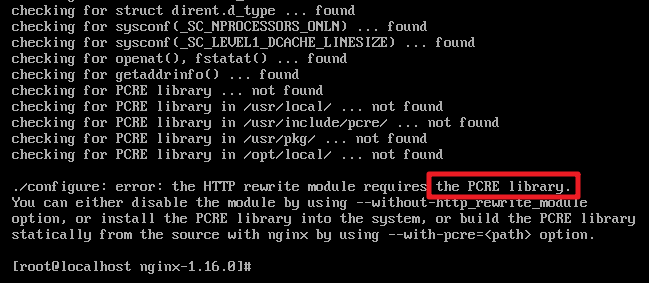
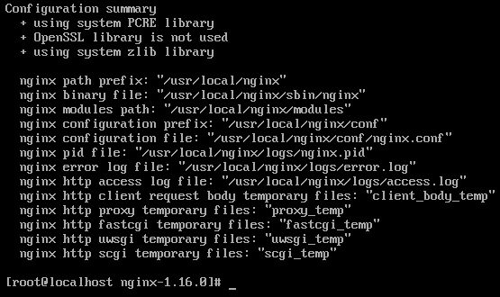

# Linux 之 Nginx 安装与使用

> 本篇笔记参考自博客：[linux nginx安装以及配置](https://blog.csdn.net/w410589502/article/details/70787468)

## 一、简介

Nginx 是一个 web 服务器，也可以用来做负载均衡及反向代理使用，目前使用最多的就是负载均衡。

## 二、Nginx Linux 版本的基本使用

### 2.1 下载

Nginx 的官方网址：[http://nginx.org](http://nginx.org/)



*其中，mainline 表示主线（最新）版本；stable 表示稳定版本*

或者

在 Linux 中使用 wget 命令下载：`wget -c https://nginx.org/download/nginx-1.16.0.tar.gz`



### 2.2 使用步骤

#### 2.2.1 解压安装包

```bash
tar -zxvf nginx-1.16.0.tar.gz
```

#### 2.2.2 进入安装目录


#### 2.2.3 Nginx 配置

##### 2.2.3.1 使用默认配置（推荐）

````bash
./configure
````

这时一般会出现错误，提示我们添加 gcc 环境



###### 2.2.3.1.1 安装 gcc 环境

````bash
yum install gcc-c++
````

*注：若 Linux 系统版本是 aliyun，一般已经安装了 gcc 环境；而 centos7 等系统大都需要用户安装*

###### 2.2.3.1.2 继续使用默认配置

````bash
./configure
# 安装到指定路径
./configure --prefix=/usr/local/nginx
````

这里提示我们需要安装 PCRE 依赖库：



###### 2.2.3.1.3 安装 PCRE 依赖库

````bash
yum install -y pcre pcre-devel
````

*PCRE（Perl Compatible Regular Expressions）是一个 Perl 库，包括 perl 兼容的**正则表达式库**。nginx 的 http 模块使用 pcre 来解析正则表达式，所以需要在 linux 上安装 pcre 库，pcre-devel 是使用 pcre 开发的一个二次开发库。*

###### 2.2.3.1.4 安装 zlib 依赖库

````bash
yum install -y zlib zlib-devel
````

*zlib 库提供了很多种压缩和解压缩的方式， nginx 使用 zlib 对 http 包的内容进行 gzip ，所以需要在 Centos 上安装 zlib 库。*

###### 2.2.3.1.5 安装 OpenSSL 安全套接字层密码库

````bash
yum install -y openssl openssl-devel
````

*OpenSSL 是一个强大的安全套接字层密码库，囊括主要的密码算法、常用的密钥和证书封装管理功能及 SSL 协议，并提供丰富的应用程序供测试或其它目的使用。*

*nginx 不仅支持 http 协议，还支持 https（即在 ssl 协议上传输 http），所以需要在 Centos 安装 OpenSSL 库。*

###### 2.2.3.1.6 最后再次执行默认配置

````bash
./configure
````



成功！

同时，`./configure`命令会创建一个 Makefile 文件，为 C 语言提供编译需要


##### 2.2.3.2 自定义配置（不推荐）

````bash
./configure \
--prefix=/usr/local/nginx \
--conf-path=/usr/local/nginx/conf/nginx.conf \
--pid-path=/usr/local/nginx/conf/nginx.pid \
--lock-path=/var/lock/nginx.lock \
--error-log-path=/var/log/nginx/error.log \
--http-log-path=/var/log/nginx/access.log \
--with-http_gzip_static_module \
--http-client-body-temp-path=/var/temp/nginx/client \
--http-proxy-temp-path=/var/temp/nginx/proxy \
--http-fastcgi-temp-path=/var/temp/nginx/fastcgi \
--http-uwsgi-temp-path=/var/temp/nginx/uwsgi \
--http-scgi-temp-path=/var/temp/nginx/scgi
````

*注：将临时文件目录指定为：/var/temp/nginx，需要在 /var 下创建 temp 及 nginx 目录*

##### 2.2.3.3 编译并安装 Nginx

````bash
make install
# 或者
make && make install
````

<kbd>make</kbd>：编译，它从Makefile中读取指令，然后编译。

<kbd>make install</kbd>：安装，它从Makefile中读取指令，安装到指定的位置。

##### 2.2.3.4 查看安装路径

````bash
whereis nginx
````


##### 2.2.3.5 安装目录文件分析


* conf：配置文件
* html：网页文件
* logs：日志文件
* sbin：主要二进制程序

#### 2.2.4 启动、停止 Nginx

进入 Nginx 安装目录（并不是 Nginx 的解压目录），执行命令：

````bash
./sbin/nginx # 启动
./nginx # 启动
./nginx -s stop # 停止（此方式相当于先查出nginx进程id再使用kill命令强制杀掉进程）
./nginx -s quit # 停止（此方式停止步骤是待nginx进程处理任务完毕进行停止）
./nginx -s reload # 在提供服务的时候，重新刷新配置文件
kill -INT 5531 # 其中5531就是nginx的主进程号，这种方法叫做nginx信号控制
kill -HUP 5531 # 软重启
# 其实在nginx启动后，会在logs下有一个nginx.pid文件用于记录主进程号
kill -INT 'cat logs/nginx.pid'
kill -HUP 'cat logs/nginx.pid'
````

##### 2.2.4.1 Nginx 信号控制

| 信号      | 信号说明                                                     |
| --------- | ------------------------------------------------------------ |
| TERM, INT | Quick shutdown                                               |
| QUIT      | Graceful shutdown<br>优雅地关闭线程，即等请求结束后再关闭    |
| KILL      | Halts a stubborn process<br>停止一个顽固的过程               |
| HUP       | Configuration reload<br>配置重新加载<br>Start the new worker processes with a new configuration<br>使用新配置启动新的工作进程<br>Gracefully shutdown the old worker processes<br>优雅地关闭旧的工作进程，即工作中的暂时不变，先变工作中的进程<br>该命令也称为：软重启 |
| USR1      | Reopen the log files<br/>重新打开日志文件<br>重读日志，在日志按月/日分割时有用<br>例如我需要每天一个日志文件，但nginx认的并不是文件名，而是内存节点<br>就算重命名或新建名称一致的文件，还是一直往旧日志文件上写，这时就用USER1 |
| USR2      | Upgrade Executable on the fly<br/>动态升级可执行文件（平滑地升级） |
| WINCH     | Gracefully shutdown the worker processes<br/>正常关闭工作进程（配合USER2来进行升级） |

##### 2.2.4.2 查看 Nginx 配置是否有误

````bash
./sbin/nginx -t
````

##### 2.2.4.3 查看 Nginx 是否启动成功

````bash
ps aux|grep nginx
#这里能够看到，nginx分为两个进程：主进程-子进程，子进程负责工作，主进程负责管控子进程
````


或者

看能不能进入 Nginx 欢迎首页

````bash
curl localhost:端口
# 或者
curl Linux系统IP:端口
````


同时，也可以在外部局域网内使用浏览器进行访问欢迎页面


*PS：如果 curl 访问成功了，但在外部访问失败，则应该是 Linux 防火墙对端口进行了拦截*

#### 2.2.5 修改 Nginx 端口号

Nginx 的默认端口号为：80

##### 2.2.5.1 进入配置文件文件夹

````bash
cd /usr/local/nginx/conf
````

*注：这里是usr下的安装路径，不是我们解压的安装包路径*

##### 2.2.5.2 备份配置文件（可略）

````bash
cp nginx.conf nginx.conf.back
````

##### 2.2.5.3 编辑 nginx.conf 配置文件

````bash
vi nginx.conf
````


将端口号修改为 81（自定）；Esc + :wq（保存并退出） 

记住需要重新启动（推荐）

````bash
./nginx -s quit
./nginx
````

或者

重新刷新配置

````bash
./nginx -s reload
````

#### 2.2.6 设置 Nginx 开机自启动

````bash
vi /etc/rc.local
````

##### 2.2.6.1 添加语句

````bash
/usr/local/nginx/sbin/nginx
````


##### 2.2.6.2 设置权限

````bash
chmod 755 /etc/rc.local
````