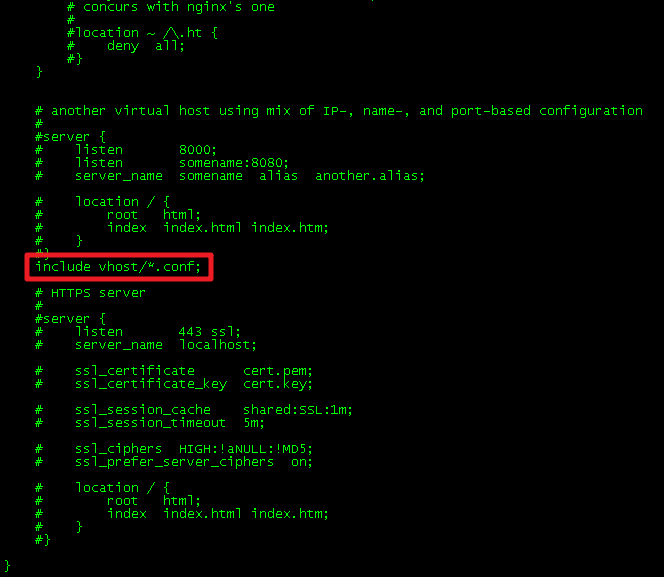
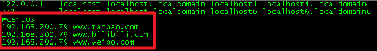
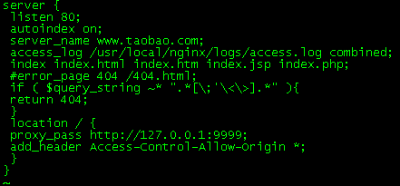
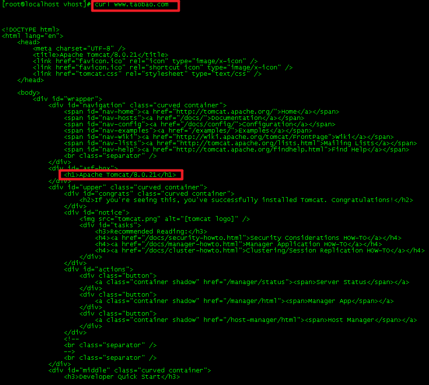
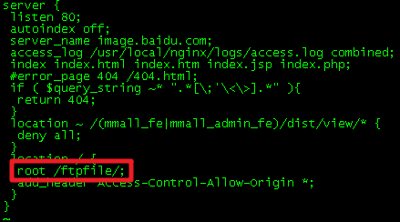
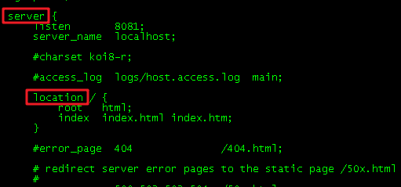

# Nginx 配置实战

> 本篇笔记参考自博客：
>
> [Nginx 简易教程](https://www.cnblogs.com/jingmoxukong/p/5945200.html)
>
> [WEB请求处理二：Nginx请求反向代理](https://www.jianshu.com/p/bed000e1830b)

## 一、预热

### 1.1 反向代理是什么？

反向代理（Reverse Proxy）是指以代理服务器来接受 internet 上的连接请求，然后将请求转发给内部网络上的服务器，并将从服务器上得到的结果返回给 internet 上请求连接的客户端，此时代理服务器对外就表现为一个反向代理服务器。

### 1.2 正向代理是什么？

正向代理（Forward Proxy）又称转发代理，是一个位于客户端和原始服务器（origin server）之间的服务器，为了从原始服务器取得内容，客户端向代理发送一个请求并指定目标（原始服务器），然后代理向原始服务器转交请求并将获得的内容返回给客户端。客户端必须要进行一些特别的设置才能使用正向代理。

**客户端必须设置正向代理服务器，当然前提是要知道正向代理服务器的IP地址，还有代理程序的端口。**

### 1.3 正向代理和反向代理区别

* 正向代理：客户端 <一> 代理 一>服务端
* 反向代理：客户端 一> 代理 <一>服务端

## 二、http 反向代理配置

### 2.1 解析域名反向代理到 webapp

#### 2.1.1 配置 nginx.conf

````bash
cd /usr/local/nginx //进入nginx安装目录
cd conf //进入conf目录
mkdir vhost //创建vhost文件夹
vim nginx.conf //修改nginx的配置文件
````

在配置文件中添加该语句：include vhost/*.conf；（不能漏分号）

> 这语句的意思是把 vhost 文件夹下的所有 .conf 文件加载过来（注意是 .conf 后缀名的文件），这么做的原因是方便以后维护，把每个域名做成一个 .conf 文件，通过主配置 include 进来，这样以后想维护某个域名，就只需直接对那个对应的 .conf 进行操作，而不会影响到其它的域名，且文件不会过于臃肿。这跟 Spring 的配置文件类似，Spring 配置文件通过把负责各个模块功能的文件 include 进去，从而避免配置文件过于复杂臃肿。



#### 2.1.2 添加一些域名来测试

````bash
vim /etc/hosts //编辑hosts文件
````



IP 地址为本机 IP，后面的域名按需修改

#### 2.1.3 创建 .conf 文件

````bash
cd vhost //进入vhost文件夹，刚才在上文已经创建了的，里面没有内容，现在要添加内容
vim www.taobao.com.conf //创建该文件并添加内容
````

````bash
server {
    listen 80;
    autoindex on;
    server_name www.taobao.com;
    access_log /usr/local/nginx/logs/access.log combined;
    index index.html index.htm index.jsp index.php;
    #error_page 404 /404.html;
    if ( $query_string ~* ".*[\;'\<\>].*" ){
    	return 404;
    }
    location / {
        proxy_pass http://127.0.0.1:9999;
        add_header Access-Control-Allow-Origin *;
    }
}
````



*其功能是当本机访问`www.taobao.com`域名时，将跳转到本地的 9999 端口的程序上，即 tomcat 欢迎页面*

#### 2.1.4 刷新 Nginx 服务器配置

esc + :wq 保存并退出

````bash
../../sbin/nginx -s reload
````

如果配置刷新失败，可以重启 Nginx

#### 2.1.5 测试效果

````bash
curl www.taobao.com
````



反向代理成功！

### 2.2 解析域名反向代理到本地文件

#### 2.2.1 hosts 添加域名

#### 2.2.2 创建 .conf 文件

````bash
vim image.baidu.com.conf //创建该文件并编辑
````

````bash
server {
    listen 80;
    autoindex off;
    server_name image.baidu.com;
    access_log /usr/local/nginx/logs/access.log combined;
    index index.html index.htm index.jsp index.php;
    #error_page 404 /404.html;
    if ( $query_string ~* ".*[\;'\<\>].*" ){
    	return 404;
    }
    location ~ /(mmall_fe|mmall_admin_fe)/dist/view/* {
    deny all;
    }
    location / {
        root /ftpfile/;
        add_header Access-Control-Allow-Origin *;
    }
}
````



功能是当用户输入`image.baidu.com`的时候，转发到本地的`/ftpfile/`文件。

#### 2.2.3 刷新 Nginx 服务器配置

#### 2.2.4 测试效果（略）

## 三、负载均衡配置

负载均衡是干嘛的？举个例子：我们的小网站，刚开始就一台 nginx 服务器，后来，随着业务量增大，用户增多，一台服务器已经不够用了，我们就又多加了几台服务器。那么这几台服务器如何调度？如何均匀的提供访问？这就是负载均衡。

**负载均衡的目的是为了解决单个节点压力过大，造成 Web 服务响应过慢，甚至严重的情况下导致服务瘫痪，无法正常提供服务。其好处是可以集群多台机器一起工作，并且对外的 IP 和域名是一样的，外界看起来就好像一台机器一样。**

### 3.1 基于 weight 权重的负载

````bash
http {

    # ... 省略其它配置

    upstream webservers{
        server 192.168.33.11 weight=10;
        server 192.168.33.12 weight=10;
        server 192.168.33.13 weight=10;
    }

    server {
        listen 80;

        location / {
            proxy_pass http://tomcats;
        }
    }

    # ... 省略其它配置
}
````

参数：`max_fails`和`fail_timeout`

* max_fails：允许请求失败的次数，默认为 1。当超过最大次数时，返回 proxy_next_upstream 模块定义的错误。
* fail_timeout：在经历了 max_fails 次失败后，暂停服务的时间。max_fails 可以和 fail_timeout 一起使用，进行健康状态检查。

````bash
upstream webservers{
    server 192.168.33.11 weight=10 max_fails=2 fail_timeout=30s;
    server 192.168.33.12 weight=10 max_fails=2 fail_timeout=30s;
    server 192.168.33.13 weight=10 max_fails=2 fail_timeout=30s;
}
````

参数：`down`和`backup`

* down：表示这台机器暂时不参与负载均衡。相当于注释掉了。
* backup：表示这台机器是备用机器，是其他的机器不能用的时候，这台机器才会被使用，俗称备胎。

````bash
upstream webservers{
    server 192.168.33.11 down;
    server 192.168.33.12 weight=10 max_fails=2 fail_timeout=30s;
    server 192.168.33.13 backup;
}
````


### 3.2 基于 ip_hash 的负载

这种分配方式，**每个请求按访问 IP 的 hash 结果分配**，这样来自同一个 IP 的访客固定访问一个后端服务器，有效解决了动态网页存在的 session 共享问题。

````bash
upstream webservers{
    ip_hash;
    server 192.168.33.11 weight=1 max_fails=2 fail_timeout=30s;
    server 192.168.33.12 weight=1 max_fails=2 fail_timeout=30s;
    server 192.168.33.13 down;
}
````

> **ip_hash 模式下，最好不要设置 weight 参数**，因为你设置了，就相当于手动设置了，将会导致很多的流量分配不均匀。
>
> **ip_hash 模式下，backup 参数不可用**，加了会报错，为啥呢？因为，本身我们的访问就是固定的了，其实，备用已经不管什么作用了。

## 四、网站有多个 webapp 配置


## 五、https 反向代理配置


## 六、静态站点配置


## 七、搭建文件服务器


## 八、跨域解决方案

### 8.1 Nginx 反向代理解决跨域

#### 8.1.1 Nginx 处理跨域原理

a 网站向 b 网站请求 1.js 文件时，向 b 网站发送一个获取的请求，nginx 根据配置文件接收这个请求，代替 a 网站向 b 网站来请求这个资源，nginx 拿到这个资源后再返回给 a 网站，以此来解决了跨域问题。

#### 8.1.2 具体操作

````bash
cd /usr/local/nginx //进入nginx安装目录
cd conf //进入conf目录
vim nginx.conf //修改nginx的配置文件
````



其中 server 代表启动的一个服务，location 是一个定位规则。

````bash
# 所有以/开头的地址，表示是所有请求
location / {
	# 去请求../html文件夹里的文件,其中..的路径在nginx里面有定义，安装的时候会有默认路径
    root   html;
    # 首页响应地址 
    index  index.html index.htm;
}
````

由此可知，location 是 nginx 用来路由的入口，所以接下来要在 location 里面完成反向代理的配置。

现在假设是`www.a.com/html/msg.html`想请求`www.b.com/api/?method=1&para=2`；

ajax：

````javascript
var url = 'http://www.b.com/api/msg?method=1&para=2';
$.ajax ({
    type: "GET",
    url: url,
    success: function(res){..},
    ....
})
````

这时会出现跨域的问题，所以修改一下请求的 url，让请求发在 nginx 的一个 url 下。

````javascript
var url = 'http://www.b.com/api/msg?method=1&para=2';
var proxyurl = 'msg?method=1&para=2';
// 假如实际地址是：www.c.com/proxy/html/api/msg?method=1&para=2;其中www.c.com是nginx主机地址
$.ajax({
    type: "GET",
    url: proxyurl,
    success: function(res){..},
    ....
})
````

再在刚才的路径中匹配到这个请求，我们在 location 下面再添加一个 location。

````bash
# '^~/proxy/html/'是一个匹配规则，用于拦截请求，匹配任何以 /proxy/html/开头的地址，匹配符合以后，停止往下搜索正则
location ^~/proxy/html/{
	# 代表重写拦截进来的请求，并且只能对域名后边的除去传递的参数外的字符串起作用。例如www.c.com/proxy/html/api/msg?method=1&para=2中只对/proxy/html/api/msg重写
	# rewrite后面的参数是一个简单的正则：^/proxy/html/(.*)$，$1代表正则中的第一个()，$2代表第二个()的值,以此类推
	# break代表匹配一个之后停止匹配
    rewrite ^/proxy/html/(.*)$ /$1 break;
    # proxy_pass表示把请求代理到其他主机
    proxy_pass http://www.b.com/;
}
````

### 8.2 Nginx 配置 CORS 实现指定子域名跨域

#### 8.2.1 什么是 CORS

CORS 是一个 W3C 标准，全称是跨域资源共享（Cross-Origin Resource Sharing）。它允许浏览器向跨源服务器，发出 XMLHttpRequest 请求，从而克服了 AJAX 请求只能同源使用的限制。

当前几乎所有的浏览器（Internet Explorer 8+，Firefox 3.5+，Safari 4+ 和 Chrome 3+）都可通过名为跨域资源共享（Cross-Origin Resource Sharing）的协议支持 AJAX 跨域调用。

Chrome，Firefox，Opera，Safari 都使用的是 XMLHttpRequest2 对象，IE 使用 XDomainRequest。

简单来说就是跨域的目标服务器要返回一系列的 Headers，通过这些 Headers 来控制是否同意跨域。跨域资源共享（CORS）也是未来的跨域问题的标准解决方案。

CORS 提供如下 Headers，Request 包和 Response 包中都有一部分。

**HTTP Response Header**

- Access-Control-Allow-Origin
- Access-Control-Allow-Credentials
- Access-Control-Allow-Methods
- Access-Control-Allow-Headers
- Access-Control-Expose-Headers
- Access-Control-Max-Age

**HTTP Request Header**

- Access-Control-Request-Method
- Access-Control-Request-Headers

其中最敏感的就是 Access-Control-Allow-Origin 这个 Header，它是 W3C 标准里用来检查该跨域请求是否可以被通过（Access Control Check）。如果需要跨域，解决方法就是在资源的头中加入 Access-Control-Allow-Origin 指定你授权的域。

