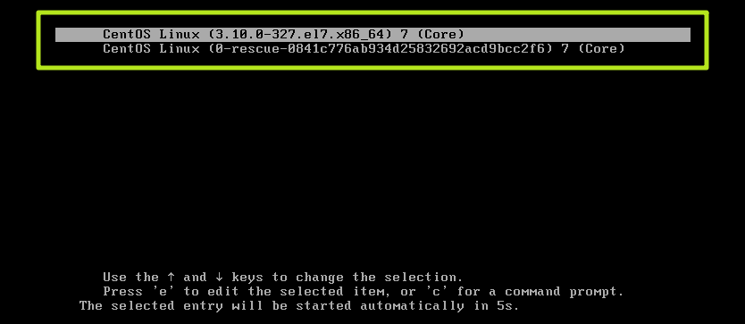
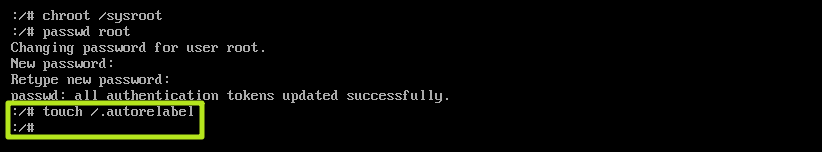
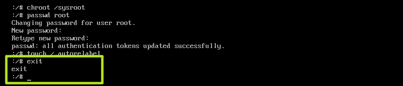

# Linux 忘记 root 密码

> 本篇笔记参考自博客：[CentOS7.2 忘记root密码及重置root密码的简单处理方法](https://www.jb51.net/article/146320.htm)

1、在启动 GRUB 菜单中选择编辑选项，按键 "e" 进入编辑

2、大约在第 16 行找到 "ro" ，将 "ro" 修改为 " rw init=/sysroot/bin/bash "

3、同时按下 " ctrl + x "，进入单用户模式

4、用 "chroot /sysroot " 命令进入系统

5、" passwd root " 重置 root 密码

6、用 " touch /.autorelabel " 更新 SELinux 信息

7、输入 " exit "退出 chroot

8、用 " reboot -f " 命令重启你的系统

9、登陆系统测试

